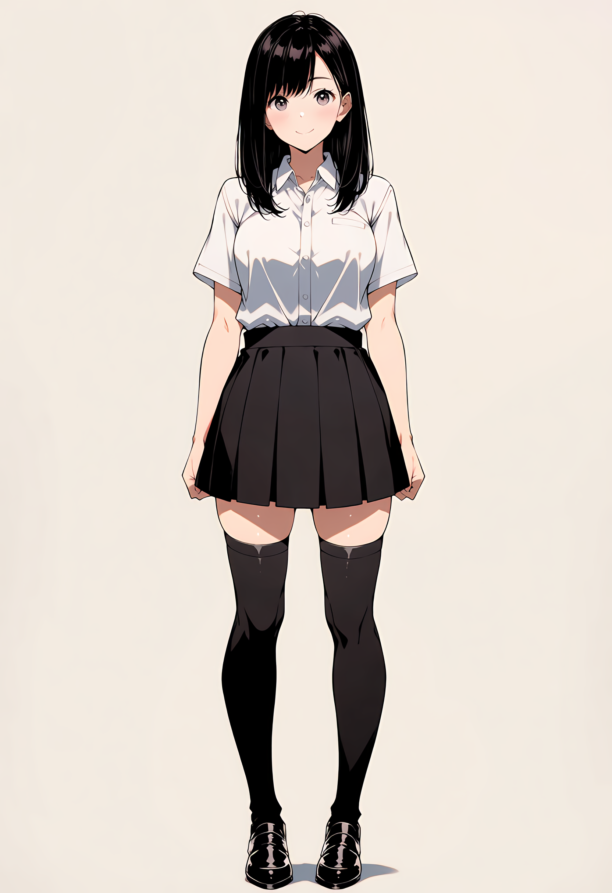
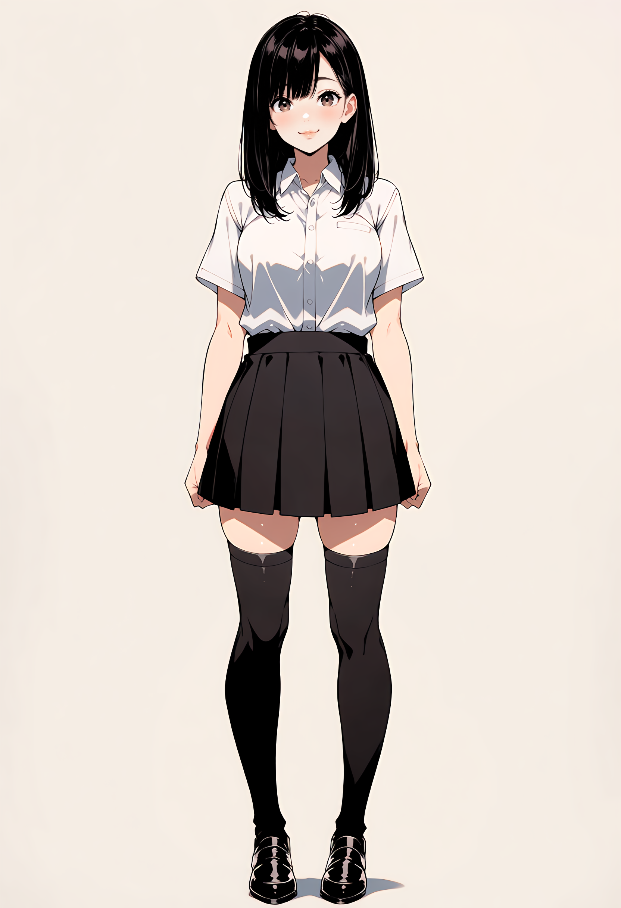
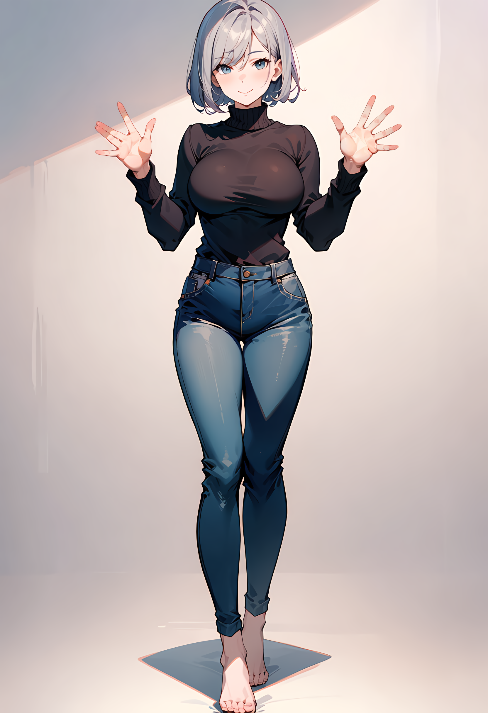
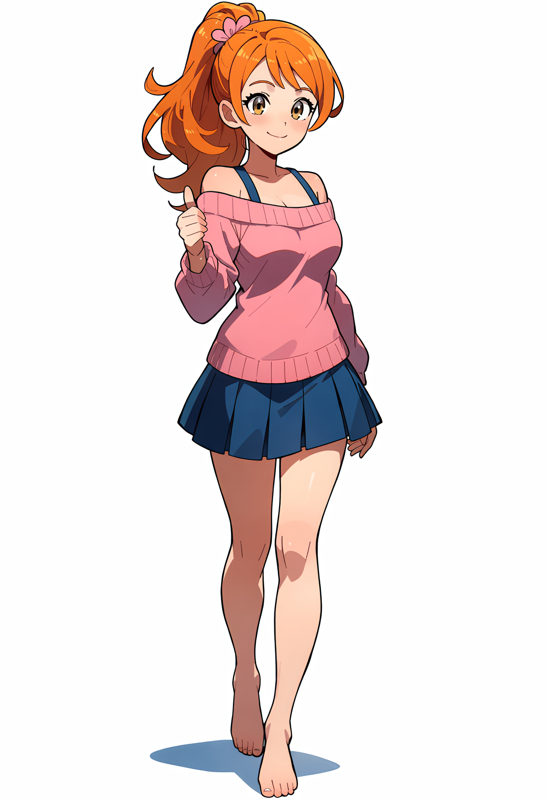
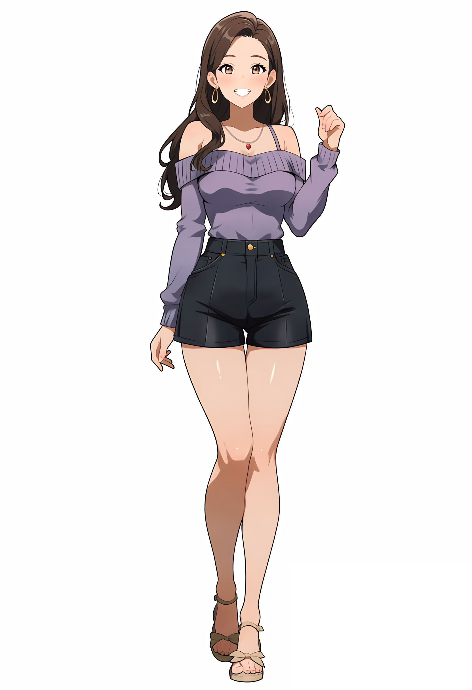
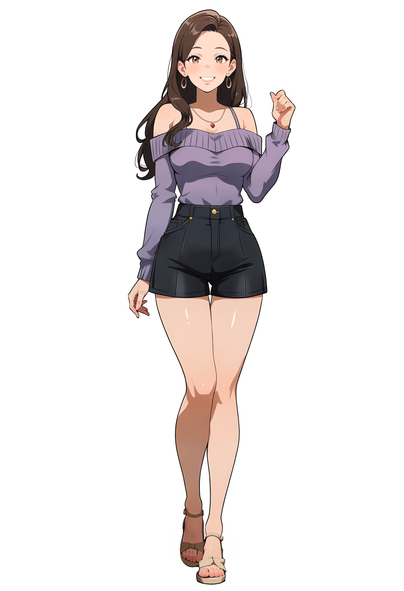

# Tulut Auto Detailer for ComfyUI (Optimized for Anima Models)

A  suite of custom nodes for ComfyUI specifically designed to **assist Anima models in repairing the loss of details in full-body shots caused by insufficient pixel resolution**. 

When rendering full-body portraits, faces, hands, and feet often crumble due to a lack of allocated pixels. This tool solves that exact pain point: it leverages YOLOv8 models for precise object detection, crops and upscales the low-res regions, applies intelligent resampling, and features fully embedded AnimaLLLite support to restore crisp, high-quality anime aesthetics seamlessly.

## Features
- **Full-Body Detail Restoration**: Specifically engineered to fix blurred faces, distorted hands, and missing foot details in wide/full-body anime compositions where pixel density is too low.
- **Optimized for Anime/Anima Workflows**: Tailored to maintain the sharp line art, clean shading, and stylistic consistency characteristic of anime models.
- **Tulut Face Detailer**: Automatically detects and refines anime faces using `face_yolov8m.pt`.
- **Tulut Hand Detailer**: Automatically detects and refines hands using `hand_yolov8s.pt`.
- **Tulut Foot Detailer**: Automatically detects and refines feet using `FootYolov8x_v20.pt`.
- **Embedded AnimaLLLite Support**: No external node connections needed. Select your AnimaLLLite model directly within the node parameters for precision localized network injection.
- **Hardware Upscaling & Dynamic Resampling**: Seamlessly incorporates upscale models (like CUGAN) with smart grid resampling based on the target guide size to keep lines perfectly crisp.

---

## Workflow & Preview

### 1. Full Workflow Example
Here is a standard workflow demonstrating how to use the Tulut Detailer nodes with an upscale model (AnimaLLLite is natively embedded and selectable right inside the node):


### 2. Comparison (Before vs. After)

#### 🔹 Face Refinement
| Before | After |
| :---: | :---: |
|  |  |

#### 🔹 Hand Refinement
| Before | After |
| :---: | :---: |
|  |  |

#### 🔹 Foot Refinement
| Before | After |
| :---: | :---: |
|  |  |

#### 🔹 Full-Body Combined Refinement (All Three Enabled)
| Before | After |
| :---: | :---: |
|  |  |

---

## Model Installation (Crucial)

Before using these nodes, you **must** download the required YOLO detection models and place them in the correct directory. The node will automatically create the subfolders if they do not exist.

### Target Directory Path:
Put your `.pt` files into your ComfyUI models directory under the following structure:
```text
<Your-ComfyUI-Root-Folder>/models/ultralytics/bbox/
