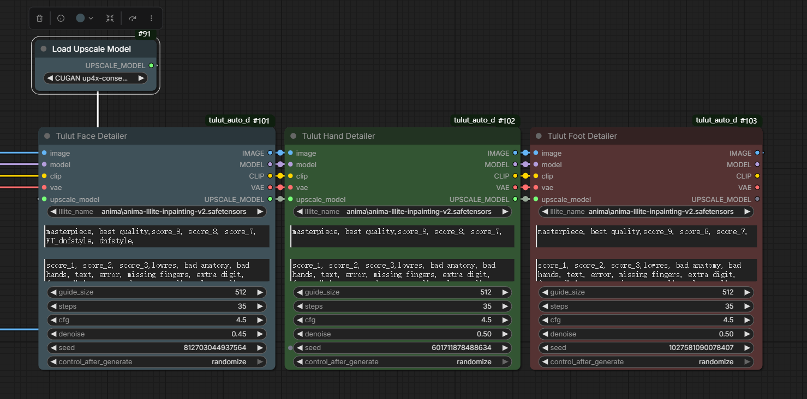

# Tulut Auto Detailer for ComfyUI (Optimized for Anime/Anima Models)

A suite of custom nodes for ComfyUI specifically optimized for **Anime/Anima models**, designed for automated local refinement and detailing of faces, hands, and feet. It leverages YOLOv8 models for precise object detection, supports hardware-level upscaling, intelligent resampling, and features fully embedded AnimaLLLite support to deliver pristine, high-quality anime aesthetics.

## Features
- **Optimized for Anime/Anima Workflows**: Tailored specifically to maintain stylistic consistency, sharp line art, and clean shading characteristic of anime models.
- **Tulut Face Detailer**: Automatically detects and refines anime faces using `face_yolov8m.pt`.
- **Tulut Hand Detailer**: Automatically detects and refines hands using `hand_yolov8s.pt`.
- **Tulut Foot Detailer**: Automatically detects and refines feet using `FootYolov8x_v20.pt`.
- **Embedded AnimaLLLite Support**: No external node connections needed. Select your AnimaLLLite model directly within the node parameters for precision localized network injection.
- **Hardware Upscaling & Dynamic Resampling**: Seamlessly incorporates upscale models (like CUGAN) with smart grid resampling based on the target guide size to keep lines crisp.

---

## Workflow & Preview

### 1. Full Workflow Example
Here is a standard workflow demonstrating how to use the Tulut Detailer nodes with an upscale model (AnimaLLLite is natively embedded and selectable right inside the node):



### 2. Comparison (Before vs. After)
Localized enhancement comparison showcasing the capabilities of anime face, hand, and foot refinement:


---

## Model Installation (Crucial)

Before using these nodes, you **must** download the required YOLO detection models and place them in the correct directory. The node will automatically create the subfolders if they do not exist.

### Target Directory Path:
Put your `.pt` files into your ComfyUI models directory under the following structure:
```text
<Your-ComfyUI-Root-Folder>/models/ultralytics/bbox/
